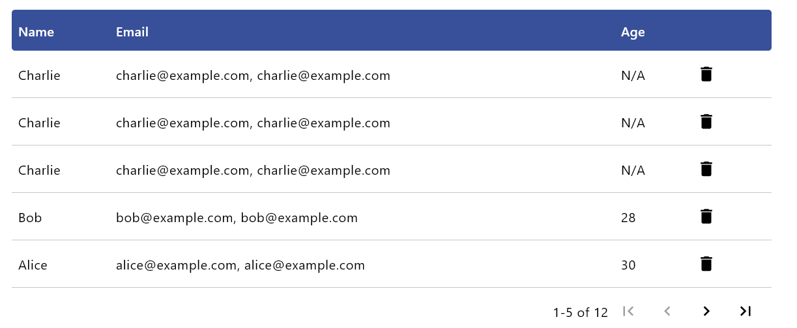

# Compose Table

This is a `Compose Multiplatform` table library that supports both Material and Material3 designs.




## Supported Platforms

* Android
* Desktop
* iOS
* WasmJS

## Usage

### Dependency

```kotlin
implemention("io.github.windedge.table:table:<version>")
```

### Static Data Table

```kotlin
import androidx.compose.material3.Text
import io.github.windedge.table.DataTable

val data = listOf(
    mapOf("Name" to "John Doe", "Age" to "30", "Email" to "john.doe@example.com"),
    mapOf("Name" to "Jane Doe", "Age" to "25", "Email" to "jane.doe@example.com")
)

DataTable(
    columns = {
        headerBackground {
            Box(modifier = Modifier.background(color = Color.LightGray))
        }
        column { Text("Name") }
        column { Text("Age") }
        column { Text("Email") }
    }
) {
    data.forEach { record ->
        row(modifier = Modifier) {
            cell { Text(record["Name"] ?: "") }
            cell { Text(record["Age"] ?: "") }
            cell { Text(record["Email"] ?: "") }
        }
    }
}

```

### Paginated Data Table

```kotlin
import androidx.compose.material3.Text
import io.github.windedge.table.BasePaginatedDataTable
import io.github.windedge.table.rememberPaginationState

val data = List(50) {
    mapOf("Column 1" to "Item $it", "Column 2" to "Item $it", "Column 3" to "Item $it")
}
val paginationState = rememberPaginationState(data.size, pageSize = 5)

PaginatedDataTable(
    columns = {
        headerBackground {
            Box(Modifier.background(colorScheme.primary))
        }
        column { Text("Column 1") }
        column { Text("Column 2") }
        column { Text("Column 3") }
    },
    paginationState = paginationState,
    onPageChanged = {
        data.chunked(it.pageSize)[it.pageIndex - 1]
    }
) { item: Map<String, String> ->
    row(modifier = Modifier) {
        cell { Text(item["Column 1"] ?: "") }
        cell { Text(item["Column 2"] ?: "") }
        cell { Text(item["Column 3"] ?: "") }
    }
}
```

Please check the [sample app](./sample) for a more detailed showcase.

## Credits

This project is inspired by [compose-data-table](https://github.com/sproctor/compose-data-table).


## License

This project is licensed under the MIT License.